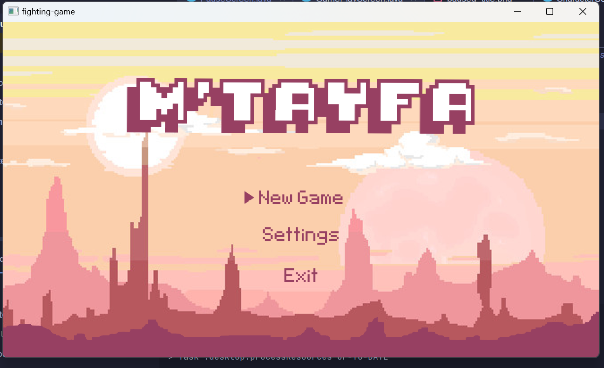
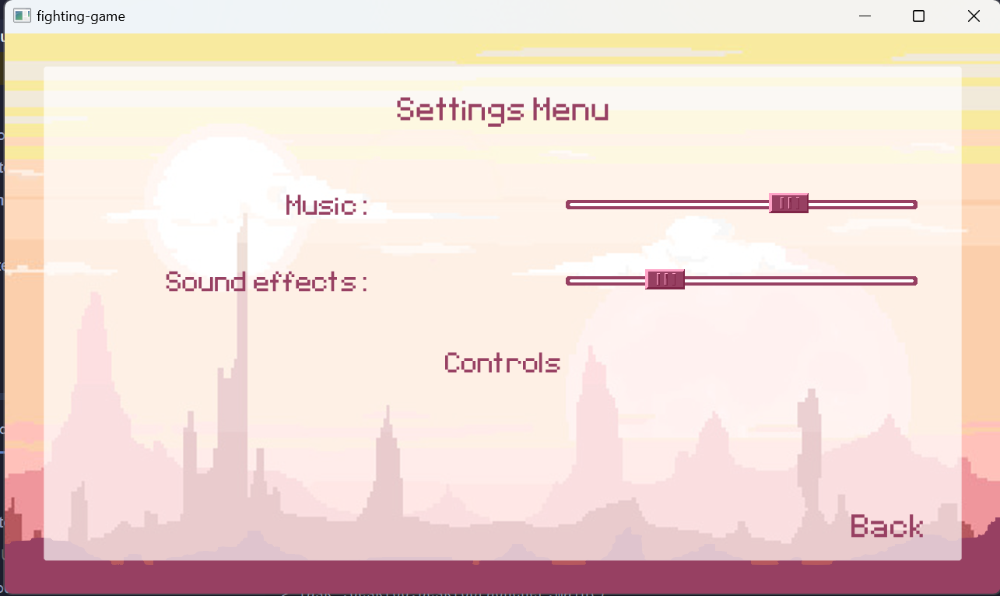
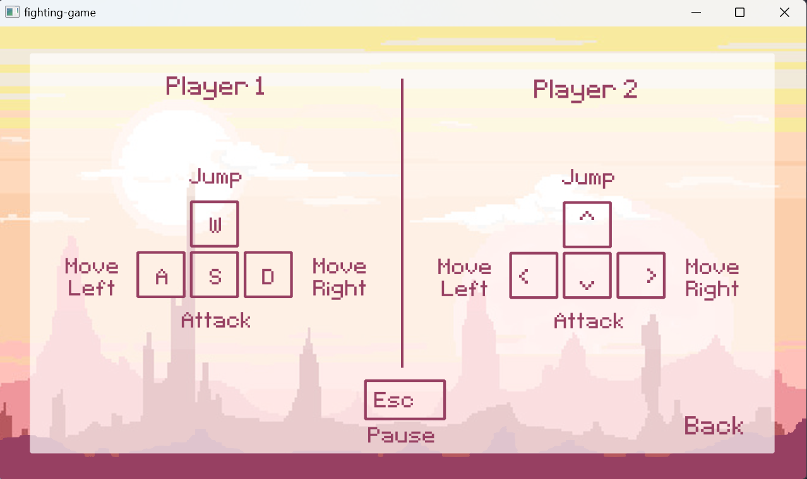
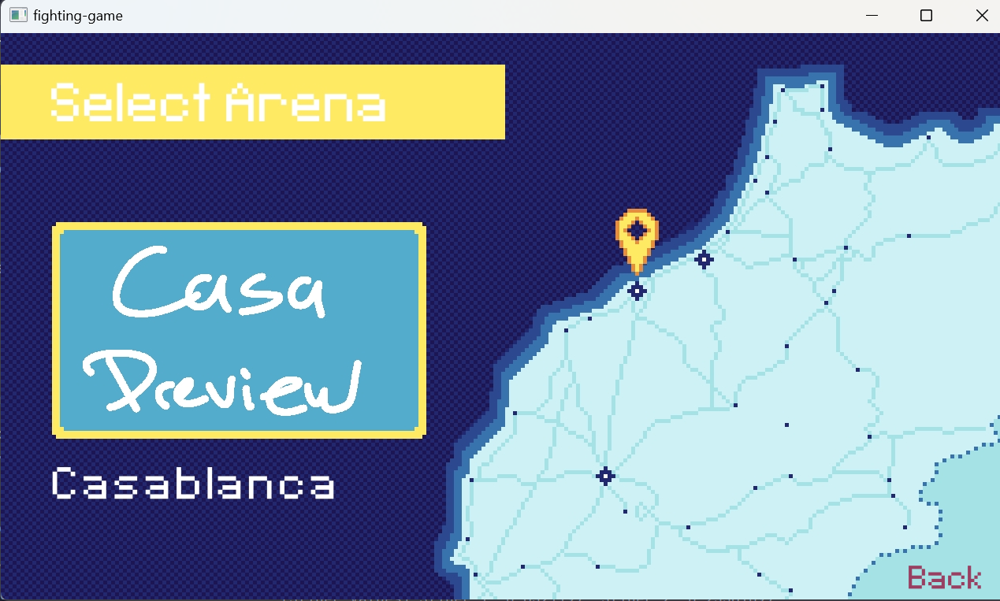
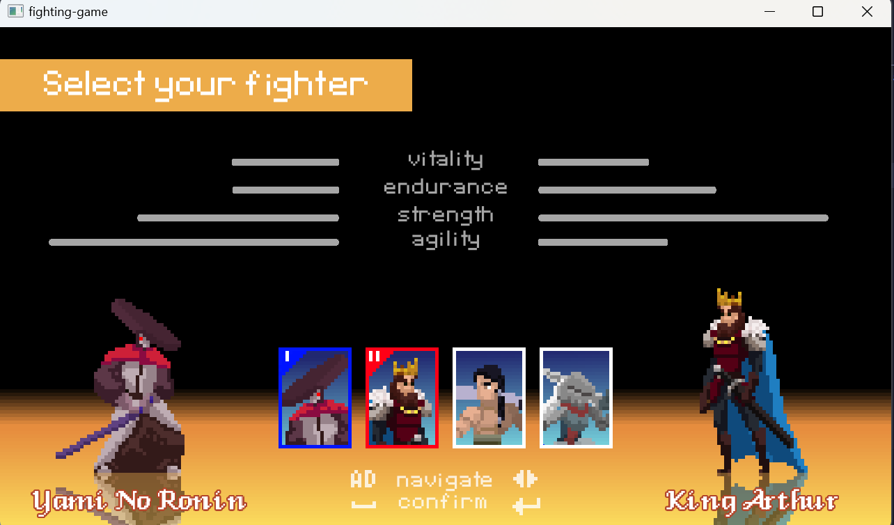
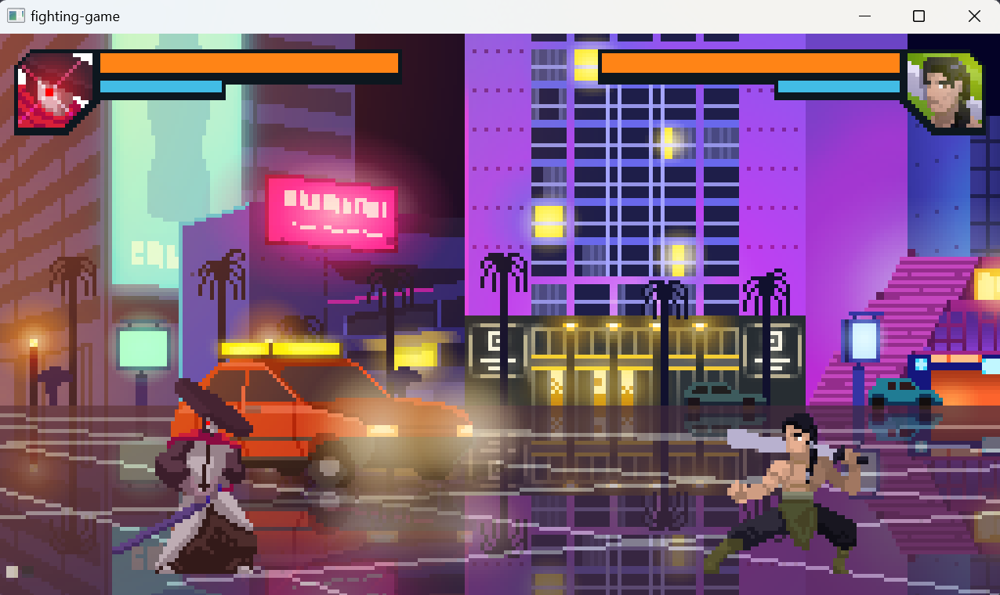

# Mtayfa

## Overview

This project is a 2D combat game developed using LibGDX, a cross-platform Java game development framework. It is a
collaboration between me [KHALSS Yassine] and [BARIK Zakariae].

## Features

- **Character Selection**: Choose from a roster of characters, each with their own strengths and weaknesses.
- **Turn-Based Combat**: Engage in strategic turn-based battles against other players.
- **Arena Selection** : Select from different Arenas inspired from Moroccan cities.
- **Abilities and Skills**: Use special abilities and skills unique to each character to gain advantage in battles.
- **Progression System**: Level up characters and unlock new abilities as you progress through the game.

## Installation

1. Clone the repository:
     ```sh
       https://github.com/YASSINEKS007/2D-Combat-Game.git
2. Open the project in your preferred Java IDE (e.g., IntelliJ IDEA, Eclipse).
3. Build the project using Gradle.

## Usage

1. Run the desktop version:
2. Follow on-screen instructions to navigate menus and start battles.

## Development

- **Structure**: The game structure follows LibGDX conventions with core, desktop modules.
- **Assets**: Place assets (images, sounds, etc.) in the respective asset
  directories (`core/assets`, `desktop/assets`).
- **Code**: Follow object-oriented principles and use LibGDX APIs for game logic, rendering, and input handling.

## Screenshots

### Home Screen


### Settings Screen


### Controllers Screen


### Select Arena Screen


### Select Fighter Screen


### Main Screen

